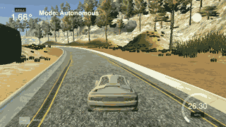
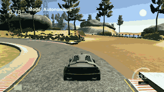
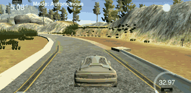

# CarND-Controls-PID
Self-Driving Car Engineer Nanodegree Program

# Compilation

## Your code should compile.
Yet it compiles fine

# Implementation

## The PID procedure follows what was taught in the lessons.
Yes I have implemented a couple of other PID for speed control.

# Reflection
# Describe the effect each of the P, I, D components had in your implementation.
P is used to control position, is the most important parameter.
D is used to avoid oscilations, when direction change is fast it decreases the change speed. D param is of opposit sign than P.
I is uses to avoud bias from target, I don't use it in this project. It would be usefull for very long straight trayectories.

## Describe how the final hyperparameters were chosen.
I at first started with a P param founding 0.21 as a good value. The nex image shows the car a second before going off the track.

Once P not too bad, I tried D param, starting with 0.5, then 1.0 and eventualy 1.5. The next image shows the car working fine, but with oscilations and params: P=0.21, D=1.0.

In the end I fine tuned parameters to P=0.21 and D=1.5 and it works fine and without oscilations as it can be seen in the next image.

# Simulation
## The vehicle must successfully drive a lap around the track.
The vehiclee drive fine and smooth, without oscilations
